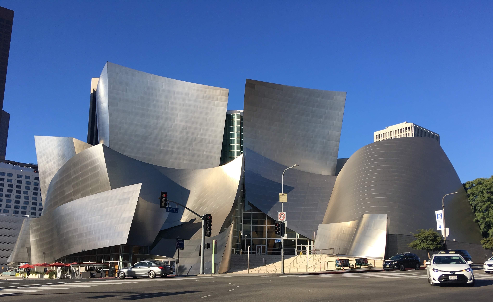
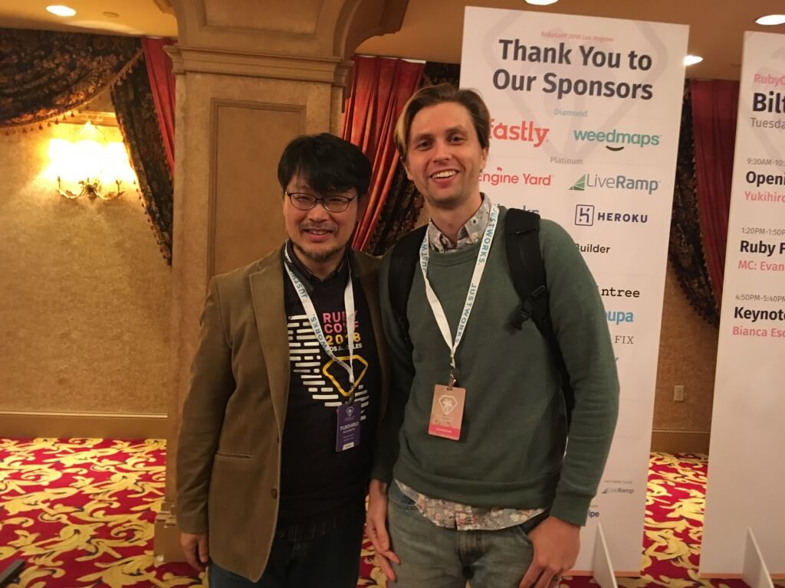
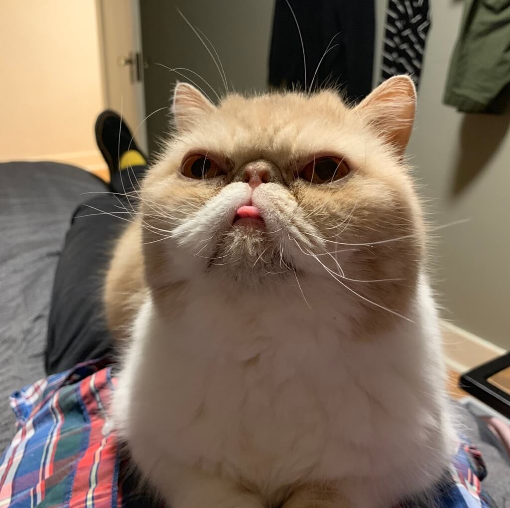
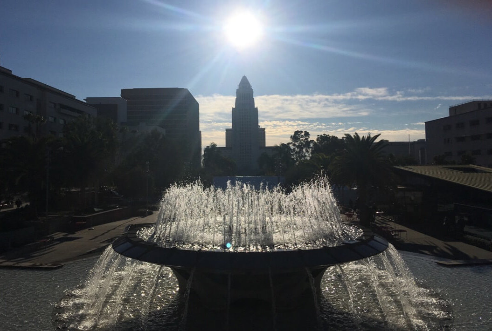


  

  


In November 2018 I had the pleasure of visiting sunny Los Angeles to attend [RubyConf](https://rubyconf.org/), my first-ever tech conference. I'll tell you about my experience of going as an Opportunity Scholar, some tips on how to get the most out of your experience, and why I think everyone should attend at least one tech conference.

<!-- more -->

## What is an Opportunity Scholarship?

An Opportunity Scholarship is offered by RubyConf as a way to bring people to the conference who otherwise might find it difficult to attend, and includes financial assistance as well as offering you an experienced Guide to help show you around. You also get the chance to attend a meet and greet the night before the conference begins so you can meet other fellow Scholars and Guides. You can find more information about the scholarships on the RubyConf [scholarships page](https://rubyconf.org/scholarships).

## How did I get to be an Opportunity Scholar?

I simply emailed the RubyConf organization. Traditionally you apply for a scholarship through their site, and if you are accepted, the cost of the conference ticket (and maybe some of your lodging) is covered for you. I was lucky enough that they had an extra spot for me to join in the program, even though I wasn't joining via the traditional avenue. My employer was gracious enough to cover the cost of the ticket and my stay there, but I had other reasons to be interested in going as a scholar.

First of all I didn't like the idea of going alone and not knowing anyone there. I thought having a group to be a part of would make the experience much more enjoyable, which it definitely did. Also, I still considered myself a fairly new Ruby developer and thought having a Guide would be super helpful when it came to deciding what talks to go to, to help me decipher more challenging talks, and introduce me to some interesting connections they might have (all of which they graciously did).

So if you're going to a conference for the first time, see if they have a scholarship program, and maybe even ask if they'd allow you to be a late add-on like I was. They just might let you join!

# My greatest takeaways from attending RubyConf

One of the greatest parts of the conference was simply being in the presence of so many other developers. There's a certain energy to it in that you're all there to learn and grow, and you get to see the community of developers in the flesh instead of just through Stack Overflow and Medium posts.

Although socializing with people you hardly know can be scary, meeting with other developers and hearing their stories was definitely the highlight of the conference. So be bold and introduce yourself to people! I regretted not meeting more people, and every time I did I was met with warmth and a great conversation.

Another surprising thing about the conference was how non-technical it was. There was a great emphasis on community, inclusion, and doing good things for the world. Some of the most interesting talks I attended were part of the Ethics track that was offered that year. I learned all about how developing software ethically can mean so much, even sometimes being a matter of life or death for others. Also, there was a great emphasis on how to best communicate with your coworkers and create positive, psychologically safe spaces that can help teams excel.

# The fun stuff

I got to meet [Matz](https://en.wikipedia.org/wiki/Yukihiro_Matsumoto) and take a picture with him 🤯

Aaron Patterson, aka [Tenderlove](https://twitter.com/tenderlove), AirDropped me a picture of his grumpy-looking cat 😹

The conference was in beautiful downtown Los Angeles 😎

Feel free to comment below or send me any questions you have about attending RubyConf or otherwise, I'd be happy to elaborate!
 
