
[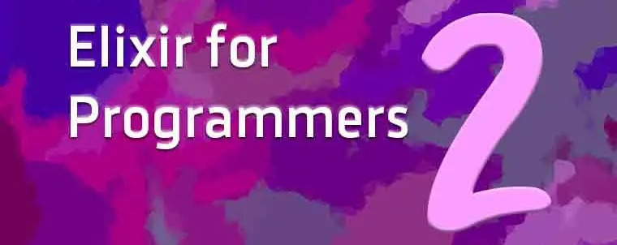]({{site.url}}/collection/2023-01-14-highlights-from-elixir-for-programmers)




I learned a lot from taking the [Elixir for Programmers](https://codestool.coding-gnome.com/courses/elixir-for-programmers-2) course by Dave Thomas, and after completing I wanted to summarize some of my most important takeaways. I especially want to focus on the architecture of the hangman game he creates as an example, as well as the tools used from Erlang's [Open Telecom Platform](https://www.erlang.org/doc/design_principles/des_princ.html) (OTP). This course shows the power of Elixir in its ability to create highly scalable, fault-tolerant applications.

<!-- more -->

In this article I'll keep things at a high-level, but will include some code examples so you can get a feel for what implementing each concept looks like. I highly recommend purchasing and going through the course yourself to get the full experience.

The course is specifically made for those who already have programming experience, but are new to Elixir and/or functional programming. The goal of the course is to build a hangman game, where a user inputs one letter at a time to try and guess an unknown word. After giving an introduction on the basics of the Elixir langauge and how to install all the required libraries, we are presented with the question of how we should structure our code.

Thomas first suggests the option of throwing everything together in one file, something like the following:


function getword() {
  // ...
}

function getPlayerGuess() {
  // ...
}

function reportScore() {
  // ...
}

function scoreMove ()) {
  // ...
}

function main() {
  getWord()
  while (!done) {
    getPlayerGuess()
    scoreMove()
    reportScore()
  }
}


While certainly doable, and nice and compact, it lacks the ability to have asynchronous interaction with the user, meaning the user has to wait for the code to finish first before sending an input. Also, it's harder to share or repurpose any of this code. For example, if we wanted to create several different types of user interfaces, such as one for the web and one for the command line, this code all being in one place makes that difficult.

The next option he suggests is to split up the code into separate independent applications:

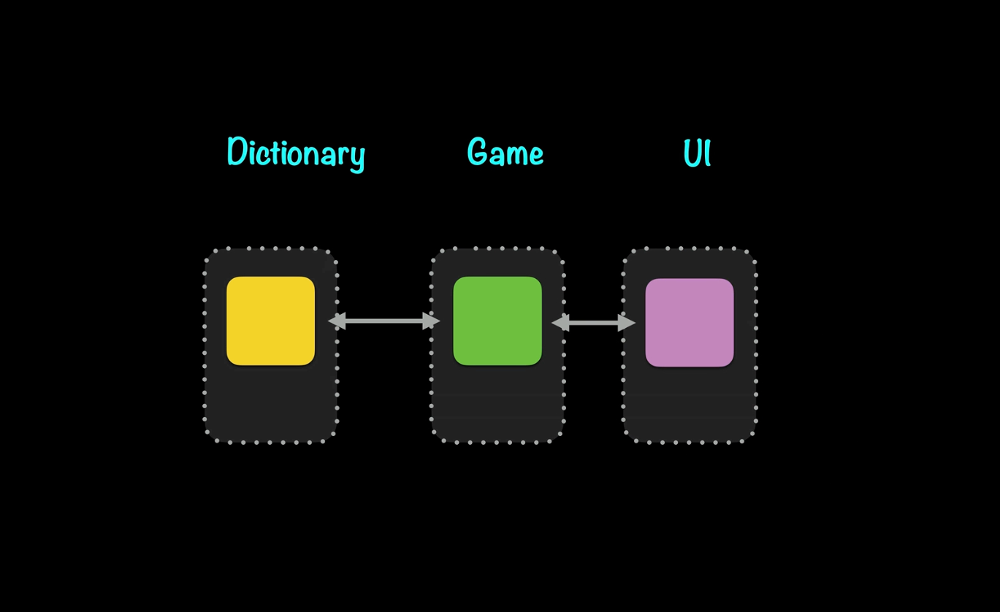

The Dictionary application will handle retreiving a random word from an array of words. The Game application will handle all of the game logic, such as determining good and bad guesses, calculating how many turns you have left, and if you've won or lost the game. Finally, the UI application will handle user inputs, such as when a user wants to start a new game or input a letter to guess.

This is clearly a much better organization of our code if we want to make it scalable and modular. Now let's get into how we can improve the efficiency of our code using the abstractions available in Elixir and OTP.

# Making the Dictionary an Agent

While our code now has a nice separation of concerns, we need to consider its scalability. Imagine that this hangman game becomes very popular and has millions of users playing at the same time. For each new hangman game that was started, we'd need the Dictionary to read from the database to get the list of possible words to start a game with, which would be quite costly in terms of performance.

The first improvement Thomas suggests is making the Dictionary an Agent. What is an Agent? I'll include the definition from the [hexdocs](https://hexdocs.pm/elixir/Agent.html):

> Agents are a simple abstraction around state.
>
> Often in Elixir there is a need to share or store state that must be accessed from different processes or by the same process at different points in time.
>
> The [`Agent`](https://hexdocs.pm/elixir/Agent.html#content) module provides a basic server implementation that allows state to be retrieved and updated via a simple API.

So basically it is a way to keep state readily available, which suits our use-case very well.

Without an Agent, at this point the Dictionary receives instructions to `start` a new game, which then calls the database like so:

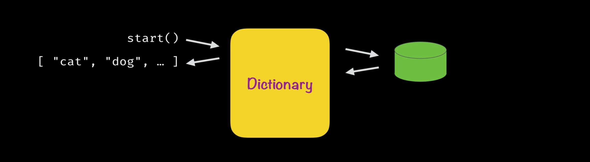

This retrieves the word list we want from the database, which we then pass to a `random_word` function in the Dictionary to get the word we want:

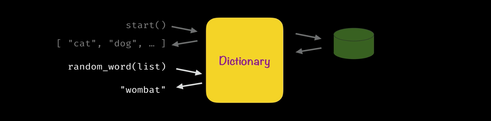

What we want to do is put the Agent between the Dictionary and the database :

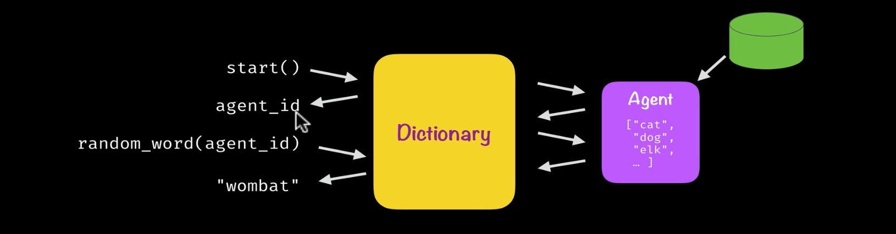

That way anytime we need to access the list of words for the game, we only have to hit the database if there isn't an Agent already running. After an Agent has been spun up, we can just go to the Agent to get our list of words which will be much more performant.

Previously, our Dictionary code called the implementation code directly like the following. Note that I'm not showing the implementation code, but I'll include comments to help explain:


defmodule Dictionary do
  # alias for our implementation code
  alias Dictionary.Impl.WordList

  # retrieves the list of words
  defdelegate start, to: WordList, as: :word_list

  # returns a random word from the list above
  defdelegate random_word(word_list), to: WordList
end


In order to add an Agent, now we need to wrap our calls to the implementation code as below. We'll create a new `Dictionary.Runtime.Server` file:


defmodule Dictionary.Runtime.Server do
  # alias for our implementation code
  alias Dictionary.Impl.WordList

  def start_link do
    # starts the Agent
    Agent.start_link(&WordList.word_list/0)
  end

  def random_word(pid) do
    # retrieves our desired value from the Agent
    Agent.get(pid, &WordList.random_word/1)
  end
end


Worth noting is that `start_link` will now return the process ID of the Agent instead of the word list itself as it did before. "What are processes?", you might ask. While I won't go into full detail, a [process](https://elixir-lang.org/getting-started/processes.html) is essentially a container that all Elixir code runs inside of. Processes are isolated from each other and run concurrently, but each process has a process ID (PID) that is handy for when you need to communicate with another process.

So now when we want to invoke `random_word` we just pass the PID instead of the entire word list. The PID is how we know which process (the one that is running the Agent) to get the dictionary list from.

Then we'll also need to modify our original `Dictionary` module to:


defmodule Dictionary do
  alias Dictionary.Runtime.Server

  # now `start_link` instead of `start`, points to `Server`
  defdelegate start_link, to: Server

  # similar to before but now we point to `Server`
  defdelegate random_word(word_list), to: Server
end


At this point in the tutorial, in the terminal you'd need to run `iex -S mix` at the root of Dictionary, then `{:ok, :pid} = Dictionary.start_link`, and finally `Dictionary.random_word(pid)` in order to get a random word. This is not a great API experience. We'll look at improving this in the next section.

# Applications: Making Our Code Independent

Even though our code has a nice separation of concerns, each concern is not running as its own independent process. This means we're missing out on all of the great features Elixir has to offer that helps to make our code more modular.

Currently Dictionary is a direct dependency of Game, and Game is a direct dependency of the UI. So when the user starts a new game from the UI, the Game and Dictionary code are started synchronously as a result. Each concern doesn't have the ability to start or manage itself.

Giving the ability for each concern to start and manage its own lifecycle is how we turn each into what in Elixir is referred to as an [Application](https://hexdocs.pm/elixir/1.12/Application.html). In order to turn the Dictionary into its own Application, we create an `application.ex` file with the following:


defmodule Dictionary.Runtime.Application do
  # provides necessary default configurations
  use Application

  def start(_type, _args) do
    Dictionary.Runtime.Server.start_link()
  end
end


Then in the `Dictionary.Runtime.Server` module, where we implemented the Agent above, we add a `name` to `start_link` and `random_word`. Using a `name` will replace the need to pass PIDs as we were doing before:


defmodule Dictionary.Runtime.Server do
  # __MODULE__ is shorthand for `Dictionary.Runtime.Server`
  @me __MODULE__

  alias Dictionary.Impl.WordList

  def start_link do
    # notice we add `name` as an arg
    Agent.start_link(&WordList.word_list/0, name: @me)
  end

  def random_word() do
    # notice @me is added as an arg
    Agent.get(@me, &WordList.random_word/1)
  end
end


Finally, in our mix.exs file we need to add the following:


def application do
  [
    mod: { Dictionary.Runtime.Application, [] },
  ]
end


This is needed so that when we use `mix` to start the Dictionary, it knows where to look to start the Application. So now Dictionary has the ability to start itself when running `iex -S mix` at the root. You can now call `Dictionary.random_word` to get a random word. That is a much easier API to work with.

# Add a Supervisor to Dictionary

Now that Dictionary is an Application, it has the ability to manage its own lifecycle. However, to implement this we will need to add a [Supervisor](https://hexdocs.pm/elixir/1.12/Supervisor.html). Thomas uses the analogy of kids at a playground (processes) and the nannies who are watching over the children (supervisors):

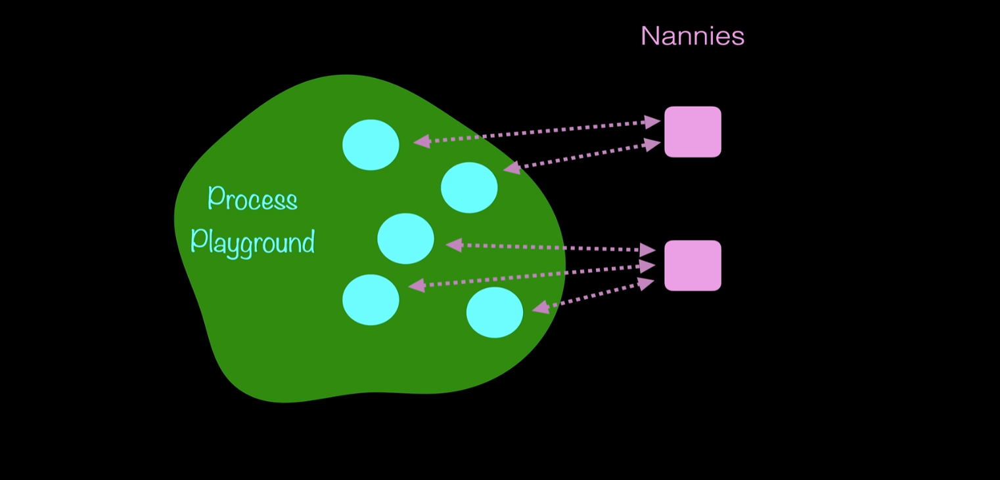

If a child falls over, the nannies are there to pick them up. In the same way, supervisors are given processes to look after, and if any of their processes crash they are there to help get them running again.

This creates a supervision tree. You can think of processes as the code that does the work, while supervisors are there to just manage the processes. It is also worth noting that a group of supervisors can themselves have a common supervisor.

To implement a Supervisor in Dictionary, our `application.ex` file will be modified:


defmodule Dictionary.Runtime.Application do
  use Application

  def start(_type, _args) do
	# the children our Supervisor will watch over
    children = [
      { Dictionary.Runtime.Server, [] }
    ]

	# give the Supervisor a name and a strategy
    options = [
      name: Dictionary.Runtime.Supervisor,
      strategy: :one_for_one,
    ]

	# we pass our Server module into a `Supervisor`
    Supervisor.start_link(children, options)
  end
end


A couple of small changes will need to be made in our `server.ex` file as well:


defmodule Dictionary.Runtime.Server do
  @me __MODULE__

  # this provides necessary defaults needed when using a Supervisor
  use Agent

  alias Dictionary.Impl.WordList

  # adding ignored `options` argument from Supervisor `(_)`
  def start_link(_) do
    Agent.start_link(&WordList.word_list/0, name: @me)
  end

  ...
end


So now if the Dictionary Agent were to crash for whatever reason, a new process will spin up in its place thanks to the Supervisor. This is what is meant by Elixir being 'fault-tolerant'. One part of the system can crash, but it doesn't have to crash the other parts of your app and everything can continue running as normal once the failing process is restarted.

# Review of how things are working so far

When we invoke `mix run` in the root of our Dictionary, here's what's happening in terms of processes:

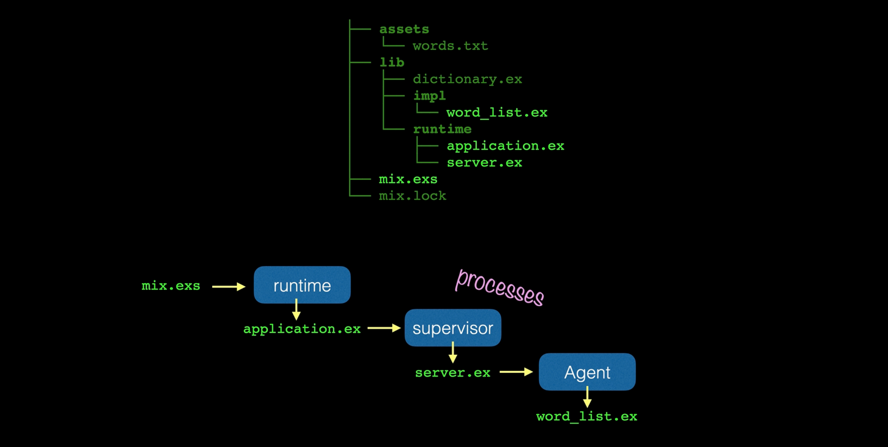

First we start at the `mix.exs file`, where we get the project settings such as which version of Elixir to use, what applications to run, and what dependencies to include. Here's how Dictionary's `mix.exs` file looks at this point:


defmodule Dictionary.MixProject do
  use Mix.Project

  def project do
    [
      app: :dictionary,
      version: "0.1.0",
      elixir: "~> 1.12",
      start_permanent: Mix.env() == :prod,
      deps: deps()
    ]
  end

  def application do
    [
	  # this tells mix to include `Dictionary.Runtime.Application`
      mod: {Dictionary.Runtime.Application, []},
      extra_applications: [:logger]
    ]
  end

  defp deps do
    [
      ...
    ]
  end
end


The key line here is:


  mod: {Dictionary.Runtime.Application, []},


With that line, `mix` now knows to look to the `application.ex` file to start the application. In `application.ex` we have a Supervisor that is told to watch over our `server.ex` file. Finally, in `server.ex` we create an `Agent` with `start_link` and make calls to get a random word with `Agent.get`. Each step along the way we are creating processes.

That is the current way the Dictionary code runs, now let's take a look at how we can give Hangman a more independent existence.

# Make Hangman a Server

To make Hangman (synonymous to mentions of 'Game' above) more independent, Thomas recommends using a GenServer (aka "generic server"). This is how GenServer is defined in [hexdocs](https://hexdocs.pm/elixir/GenServer.html):

> A behaviour module for implementing the server of a client-server relation.
>
> A GenServer is a process like any other Elixir process and it can be used to keep state, execute code asynchronously and so on. The advantage of using a generic server process (GenServer) implemented using this module is that it will have a standard set of interface functions and include functionality for tracing and error reporting. It will also fit into a supervision tree.

A GenServer is a good fit for Hangman as it provides an external API (code that runs in the client) and internal callbacks (server process), and helps to abstract common client-server interactions:

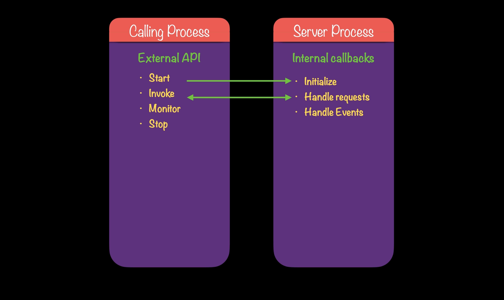

As we start out, our `hangman.ex` file looks like so, similar to how we started with Dictionary, we are directly making calls to our implementation code (implementation code not shown, imagine the function names accurately describe their purpose):


defmodule Hangman do
  # alias to our implementation code
  alias Hangman.Impl.Game

  defdelegate new_game, to: Game

  defdelegate make_move(game, guess), to: Game
  
  defdelegate tally(game), to: Game
end


To implement a GenServer, we'll add a `server.ex` file in Hangman with:


defmodule Hangman.Runtime.Server do
  # alias for our implementation code
  alias Hangman.Impl.Game

  # provides necessary defaults
  use GenServer

  ### client process

  # note the addition of `GenServer` code here
  def start_link do
    # starts GenServer
    GenServer.start_link(__MODULE__, nil) 
  end

  ### server process
  
  # returns initial state
  # ignored variable (_) is unneeded `nil`, option in `start_link`
  def init(_) do
    { :ok, Game.new_game }
  end

  # triggered if the client sends a message with :make_move
  def handle_call({ :make_move, guess }, _from, game) do
    { updated_game, tally } = Game.make_move(game, guess) 
    { :reply, tally, updated_game }
  end

  # triggered if the client sends a message with :tally
  def handle_call({ :tally }, _from, game) do
    { :reply, Game.tally(game), game } 
  end
end


In `hangman.ex`, our implementation code, we'd update it to:


defmodule Hangman do
  alias Hangman.Runtime.Server

  def new_game do
	# previously we called directly to our implementation
	# now we call Server.start_link()
    { :ok, pid } = Server.start_link()
    pid
  end

  def make_move(game, guess) do
	# previously directly called our implementation code
    # now we perform a `GenServer.call`
    GenServer.call(game, { :make_move, guess })
  end
  
  def tally(game) do
    # previously directly called our implementation code
    # now we perform a `GenServer.call`
    GenServer.call(game, { :tally })
  end
end


Now Hangman is running in its own process and mantaining its own state internally. Looking forward, let's see how we can further make Hangman more independent.

# Make Hangman its own Service

Currently when we make a call from the UI, the hangman game server will live inside the UI process. It would be better if Game ran in its own node instead of being included with the client. We currently have a structure like this:

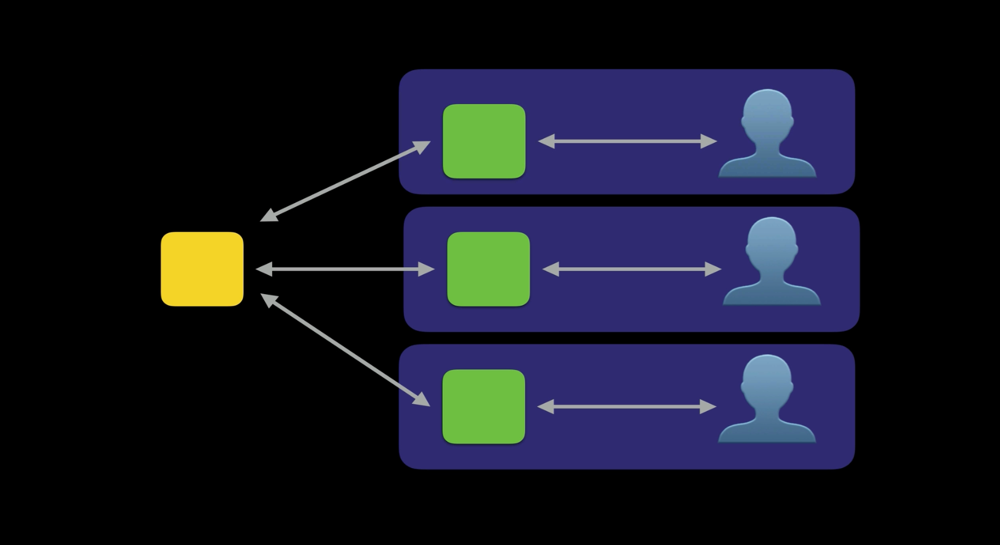

What we'd like is:

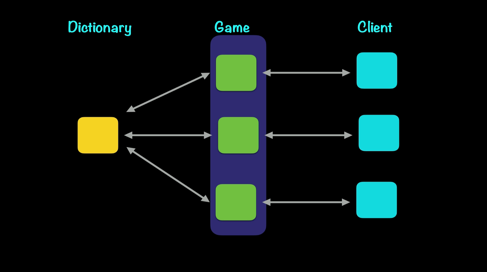

There are a few reasons why separating Game into its own node might be a good idea:
• Special resources: Game might need access to special resources such as a database that we don't want the client to have access to.
• Security: maybe Game is handling some personal information such as credit card payments and we want to keep it as secure as possible.
• Different deployment characteristics: say an engineering team wants to deploy code just to Game, without involving the client.
• To reduce load on clients: maybe some clients don't have the capacity to run both the Game and Client code at the same time.

In order to make Game its own Service, we’re going to create a 'Game creator' that spits out new games every time a client asks. Then once the game has been created, the client and the new game will speak to each other directly. What we are calling a 'Game creator' will be what's referred to in Elixir as a [Dynamic Supervisor](https://hexdocs.pm/elixir/1.12/DynamicSupervisor.html).

The flow of the code will look like the following, the key part here being the Dynamic Supervisor, which as its name implies will dynamically create new hangman games each time it receives a request to do so:

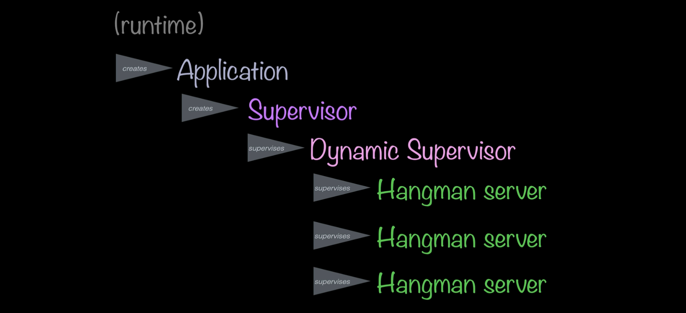

# How to implement a Dynamic Supervisor in Hangman

First we'll create an `application.ex` file in our hangman game code:


defmodule Hangman.Runtime.Application do
  @super_name GameStarter

  use Application

  # note the new `DynamicSupervisor` code below
  def start(_type, _args) do
    supervisor_spec = [
      { DynamicSupervisor, strategy: :one_for_one, name: @super_name },
    ]

    # this Supervisor will supervise the DynamicSupervisor
    Supervisor.start_link(supervisor_spec, strategy: :one_for_one)
  end

  # note the new `DynamicSupervisor` code below
  def start_game do
    DynamicSupervisor.start_child(@super_name,  { Hangman.Runtime.Server, nil })
  end
end


Previously our `hangman.ex` code contained the following with a `new_game` function:


defmodule Hangman do
  alias Hangman.Runtime.Server
  
  def new_game do
    { :ok, pid } = Server.start_link()
    pid
  end
  
  ...
end


Now we make `new_game` make a call to our new `application.ex` code:


defmodule Hangman do
  ...
  
  def new_game do
    { :ok, pid } = Hangman.Runtime.Application.start_game
    pid
  end

  ...
end


Small aside, we'll also need to pass an ignored option `(_)` to our `server.ex` file:


defmodule Hangman.Runtime.Server do
  ...

  # only the (_) is new here
  def start_link(_) do
    GenServer.start_link(__MODULE__, nil)
  end

  ...
end


Finally, we'll need to register our `Hangman.Runtime.Application` in our `mix.exs` file:


defmodule Hangman.MixProject do
  ...

  # the key line here is `mod`, aka 'module' where add the Application file
  def application do
    [
      mod: { Hangman.Runtime.Application, [] },
      extra_applications: [:logger]
    ]
  end
  
  ...
end



So now when we run `iex -S mix` in the terminal and then run `Hangman.Runtime.Application.start_game`, a new game will be dynamically created and supervised. At this point we have a service that runs on its own node and any number of clients can connect to it and ask for a new game. Now Game has a much more independent existence.

# To sum up

Agents, DynamicSuperivisors, and GenServers, oh my. That was a lot to cover in one course. This doesn't even take into consideration the sections of the course that deal with Phoenix and LiveView. But here's a few bullet points to take with you:

- [Processes](https://elixir-lang.org/getting-started/processes.html) are what all Elixir code runs inside of. They are isolated from each other, run concurrent to one another and communicate via message passing.
- [Agents](https://elixir-lang.org/getting-started/mix-otp/agent.html) are great for when multiple processes need to share or store state. We used one to help save a round trip to the database to get the list of words for the hangman game.
- [Applications](https://hexdocs.pm/elixir/1.12/Application.html) "are the idiomatic way to package software in Erlang/OTP. To get the idea, they are similar to the 'library' concept common in other programming languages, but with some additional characteristics." We made Dictionary its own Application.
- [Supervisors](https://hexdocs.pm/elixir/1.12/Supervisor.html) help watch over processes, making sure they start, stop, and restart properly. We added a Supervisor to Dictionary to help it restart itself if it failed.
- [DynamicSupervisors](https://hexdocs.pm/elixir/1.12/DynamicSupervisor.html) are supervisors that start children dynamically. We used a one to help create new hangman games every time the client asked for one.
- [GenServers](https://hexdocs.pm/elixir/1.12/GenServer.html) help to implement the server of a client-server relation. They have standard interfaces, help keep track of state, execute code asynchronously, and perform tracing and error reporting. We used GenServer to help Hangman run as its own process and maintain its own state.

Hopefully this post gave you a good idea of the powerful tools that Elixir comes with to help build scalable and maintainable applications!
