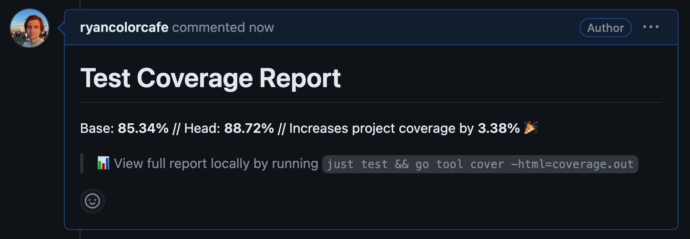







## Introduction: What is Test Coverage, and Why is it Important?

We all know tests are crucial, but how many should you write? Should you aim for 100% coverage or just focus on critical parts? While there's no definitive answer, tracking your codebase's test coverage percentage is a valuable guide. Think of it like monitoring your weight: you don't have to step on the scale every day, but it helps to check in occasionally to ensure you're on track.

<!-- more -->

Monitoring test coverage helps you see if the code you're introducing is increasing or decreasing coverage. If a new feature causes a significant drop in coverage, it's a signal to consider adding more tests–unless there's a good reason not to, like dealing with a difficult-to-test third-party library.

Many languages like Go and Jest offer built-in tools for generating detailed coverage reports. But what if you want to automate the comparison between your main branch and a new pull request (PR) to see how it impacts test coverage? Tools like [Codecov](https://about.codecov.io/) and [Code Climate](https://codeclimate.com/) offer this feature, leaving helpful comments on your PRs with the coverage impact.

However, if budget constraints are an issue, you can build this feature yourself using GitHub Actions and Artifacts. This approach lets you automatically compare coverage changes for every PR against the main branch, making it easier to maintain high testing standards without the added cost.

## Overview of the Approach

At a high level, we’ll create two separate GitHub Actions files: `test-main.yml` and `test-pr.yml`. The `test-main.yml` file is triggered on every push to the `main` branch, where it runs tests, generates a coverage report, and stores it as a GitHub Artifact. The `test-pr.yml` file runs on every PR to `main`, generates its own coverage report, compares it to the `main` branch report, and adds a comment to the PR with the resulting percentage difference.

Below, I’ll dive into the implementation details for both Go and React projects.

## Automating Test Coverage Reporting for Go

### Setting Up the `test-main.yml` File

The `test-main.yml` file is designed to run whenever there’s a push to the `main` branch. Here’s how you can set it up:


on:
  push:
    branches: - main


When there is a push to `main`, this workflow will run tests, generate a code coverage report, and store it as a GitHub Artifact. For example:


- name: Run tests with coverage
  run: go test -v -race -count=1 -coverprofile=coverage.out ./...

- name: Generate coverage report
  run: gocov convert coverage.out > coverage-report.json

- name: Run gocov report
  run: cat coverage-report.json | gocov report

- name: Upload coverage report
  uses: actions/upload-artifact@v2
  with:
    name: coverage-report
    path: ./coverage-report.json


### Setting Up the `test-pr.yml` File

The `test-pr.yml` file will run on every PR to `main` and compare the coverage of the PR branch against `main`. Here’s how to configure it:


on:
  pull_request:
    branches: - main


This workflow starts by running tests and generating a coverage report for the PR branch:


- name: Install gocov
  run: |
  go install github.com/axw/gocov/gocov@latest
  echo "$(go env GOPATH)/bin" >> $GITHUB_PATH

- name: Run tests with coverage
  run: go test -v -race -count=1 -coverprofile=coverage.out ./...

- name: Generate coverage report
  run: gocov convert coverage.out > coverage-report.json

- name: Run gocov report for PR branch
  run: cat coverage-report.json | gocov report > gocov-report-pr.txt


Next, we compare this report with the one from `main`:


- name: Download main branch coverage artifact
  uses: dawidd6/action-download-artifact@v2
  with:
    github_token: ${{ secrets.GITHUB_TOKEN }}
    workflow: test-main.yaml
    workflow_conclusion: success
    name: coverage-report
    path: ./main-coverage

- name: Run gocov report for main branch
  run: cat main-coverage/coverage-report.json | gocov report > gocov-report-main.txt

- name: Get overall coverage percentage for main branch
  id: main_coverage
  run: |
    mainPercentage=$(grep 'Total Coverage' gocov-report-main.txt | awk '{print $3}')
    echo "main_percentage=$mainPercentage" | tee -a $GITHUB_OUTPUT


Finally, we create a PR comment that shows whether the test coverage has increased or decreased:


comment_on_pr:
  runs-on: ubuntu-latest
  needs: test
  steps:
    - env:
        MAIN_PERCENTAGE: ${{needs.test.outputs.main_percentage}}
        PR_PERCENTAGE: ${{needs.test.outputs.pr_percentage}}
      uses: actions/github-script@v6.4.1
      with:
        github-token: ${{ secrets.GITHUB_TOKEN }}
        script: |
          const issue_number = context.issue.number;
          const mainCoverage = parseFloat(process.env.MAIN_PERCENTAGE);
          const prCoverage = parseFloat(process.env.PR_PERCENTAGE);
          const coverageDifference = prCoverage - mainCoverage;
          let coverageEmoji;
          if (coverageDifference > 0) {
              coverageEmoji = ":tada:";
          } else if (coverageDifference < 0) {
              coverageEmoji = ":warning:";
          }
          let commentBody;
          const comments = await github.rest.issues.listComments({
              ...context.repo,
              issue_number
          });
          const coverageComment = comments.data.find(comment => comment.body.startsWith("# Test Coverage Report"));
          if (prCoverage !== 0 && prCoverage !== mainCoverage) {
              commentBody = `# Test Coverage Report\n\nBase: **${mainCoverage.toFixed(2)}%** // Head: **${prCoverage.toFixed(2)}%** // ${coverageDifference > 0 ? 'Increases' : 'Decreases'} project coverage by **${coverageDifference.toFixed(2)}%** ${coverageEmoji}\n\n> :bar_chart: View full report locally by running \`just test && go tool cover -html=coverage.out\``;  
              if (coverageComment) {
                  github.rest.issues.updateComment({
                      ...context.repo,
                      comment_id: coverageComment.id,
                      body: commentBody
                  });
              } else {
                  github.rest.issues.createComment({
                      ...context.repo,
                      issue_number,
                      body: commentBody
                  });
              }
          } else if (coverageComment) {
              // If the coverage is equal and a coverage comment exists, delete the comment
              github.rest.issues.deleteComment({
                  ...context.repo,
                  comment_id: coverageComment.id
              });
          }


Here's an example of what the comment might look like:

## Automating Test Coverage Reporting for React

### Setting Up the `test-main.yml` File

For React projects, the approach is similar, but we use Jest’s built-in coverage tools. The `test-main.yml` file will look something like this:


on:
  push:
    branches: - main



- name: Run tests with coverage
  run: yarn test --coverage

- name: Upload coverage report
  uses: actions/upload-artifact@v2
  with:
    name: coverage-report
    path: ./coverage/coverage-summary.json


### Setting Up the `test-pr.yml` File

The `test-pr.yml` file for React projects follows a similar structure to the Go example, but with adjustments for Jest:


test:
  runs-on: ubuntu-latest

  outputs:
    main_percentage: ${{ steps.main_coverage.outputs.main_percentage }}
    pr_percentage: ${{ steps.pr_coverage.outputs.pr_percentage }}



- name: Get coverage for PR branch
  id: pr_coverage
  run: |
    if [ -f coverage/coverage-summary.json ]; then
      prPercentage=$(node -e "const coverage = require('./coverage/coverage-summary.json'); console.log(coverage.total.lines.pct);")
      echo "pr_percentage=$prPercentage" | tee -a $GITHUB_OUTPUT
    else
      echo "PR branch coverage report not found, setting coverage to 0"
      echo "pr_percentage=0" | tee -a $GITHUB_OUTPUT
    fi



- name: Download main branch coverage artifact
  uses: dawidd6/action-download-artifact@v2
  with:
    workflow: update-test-coverage.yml
    workflow_conclusion: success
    name: coverage-report
    path: ./main-coverage

- name: Get coverage for main branch
  id: main_coverage
  run: |
    if [ -f main-coverage/coverage-summary.json ]; then
      mainPercentage=$(node -e "const coverage = require('./main-coverage/coverage-summary.json'); console.log(coverage.total.lines.pct);")
      echo "main_percentage=$mainPercentage" | tee -a $GITHUB_OUTPUT
    else
      echo "Main branch coverage report not found, setting coverage to 0"
      echo "main_percentage=0" | tee -a $GITHUB_OUTPUT
    fi


Finally, we create a comment on the PR similar to the Go setup:


comment_on_pr:
  runs-on: ubuntu-latest
  needs: test
  steps:
    - env:
        MAIN_PERCENTAGE: ${{needs.test.outputs.main_percentage}}
        PR_PERCENTAGE: ${{needs.test.outputs.pr_percentage}}
      uses: actions/github-script@v6.4.1
      with:
        github-token: ${{ secrets.GITHUB_TOKEN }}
        script: |
          const issue_number = context.issue.number;
          const mainCoverage = parseFloat(process.env.MAIN_PERCENTAGE);
          const prCoverage = parseFloat(process.env.PR_PERCENTAGE);
          const coverageDifference = prCoverage - mainCoverage;
          let coverageEmoji;
          if (coverageDifference > 0) {
              coverageEmoji = ":tada:";
          } else if (coverageDifference < 0) {
              coverageEmoji = ":warning:";
          }
          let commentBody;
          const comments = await github.rest.issues.listComments({
              ...context.repo,
              issue_number
          });
          const coverageComment = comments.data.find(comment => comment.body.startsWith("# Test Coverage Report"));
          if (prCoverage !== 0 && prCoverage !== mainCoverage) {
              commentBody = `# Test Coverage Report\n\nBase: **${mainCoverage.toFixed(2)}%** // Head: **${prCoverage.toFixed(2)}%** // ${coverageDifference > 0 ? 'Increases' : 'Decreases'} project coverage by **${coverageDifference.toFixed(2)}%** ${coverageEmoji}\n\n> :bar_chart: View full report locally by running \`yarn coverage:report\``;  
              if (coverageComment) {
                  github.rest.issues.updateComment({
                      ...context.repo,
                      comment_id: coverageComment.id,
                      body: commentBody
                  });
              } else {
                  github.rest.issues.createComment({
                      ...context.repo,
                      issue_number,
                      body: commentBody
                  });
              }
          } else if (coverageComment) {
              // If the coverage is equal and a coverage comment exists, delete the comment
              github.rest.issues.deleteComment({
                  ...context.repo,
                  comment_id: coverageComment.id
              });
          }


## Conclusion

Automating test coverage reporting with GitHub Actions helps ensure your code remains robust without the overhead of manual checks. Whether using Go or React, this approach can be adapted to fit your project’s needs. The process enhances code reviews by providing clear insights into how each PR impacts overall test coverage.

There are many other features that Codecov and Code Climate offer, such as badges for your Readme and detailed web-based coverage reports. While these are great, building your own solution can give you more control and save costs. However, as these tools evolve, it may be worth considering their paid options for additional functionality, especially with new AI features being introduced.
